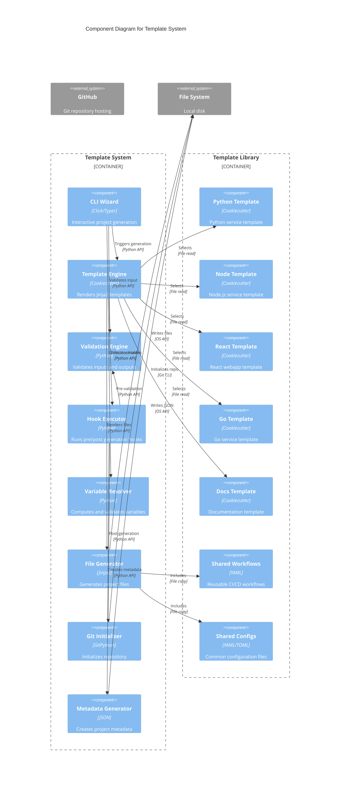

# C4 Component Diagram - Template System

## Overview

This Component diagram zooms into the Template System container, showing the internal components, their responsibilities, and how they interact with each other.

## Diagram



## Plain Text Representation

```
┌────────────────────────────────────────────────────────────────────────┐
│                          TEMPLATE SYSTEM                               │
├────────────────────────────────────────────────────────────────────────┤
│                                                                        │
│  User Interface Layer:                                                 │
│  └─ CLI Wizard (Click/Typer) - Interactive prompts and validation     │
│                                                                        │
│  Core Processing Layer:                                                │
│  ├─ Template Engine (Cookiecutter) - Orchestrates generation          │
│  ├─ Variable Resolver (Python) - Computes variables                   │
│  ├─ Validation Engine (Python) - Input/output validation              │
│  └─ Hook Executor (Python) - Pre/post generation hooks                │
│                                                                        │
│  Generation Layer:                                                     │
│  ├─ File Generator (Jinja2) - Renders template files                  │
│  ├─ Git Initializer (GitPython) - Repository setup                    │
│  └─ Metadata Generator (JSON) - Project metadata                      │
│                                                                        │
└────────────────────────────────────────────────────────────────────────┘
                                    ↓ uses
┌────────────────────────────────────────────────────────────────────────┐
│                          TEMPLATE LIBRARY                              │
├────────────────────────────────────────────────────────────────────────┤
│                                                                        │
│  Template Types:                                                       │
│  ├─ Python Template (FastAPI/Flask services)                          │
│  ├─ Node Template (Express/Fastify services)                          │
│  ├─ React Template (Vite + React + TypeScript)                        │
│  ├─ Go Template (HTTP services)                                       │
│  └─ Docs Template (Jupyter Book documentation)                        │
│                                                                        │
│  Shared Resources:                                                     │
│  ├─ Shared Workflows (CI/CD YAML templates)                           │
│  └─ Shared Configs (Common configuration files)                       │
│                                                                        │
└────────────────────────────────────────────────────────────────────────┘
```

## Component Details

### User Interface Layer

#### CLI Wizard

**Responsibility**: Provide interactive command-line interface  
**Technology**: Python with Click/Typer framework  
**Key Functions**:

```python
def init_command():
    """Main entry point for agentic-canon init."""
    project_type = prompt_project_type()
    stack = prompt_stack(project_type)
    variables = collect_variables(stack)
    features = prompt_features()
    confirm = show_summary(variables, features)
    if confirm:
        generate_project(stack, variables, features)
```

**Interfaces Exposed**:

- `init()` - Interactive project generation
- `validate()` - Validate existing project
- `update()` - Update from template (future)

**Dependencies**:

- Variable Resolver
- Validation Engine
- Template Engine

### Core Processing Layer

#### Template Engine

**Responsibility**: Orchestrate the entire generation process  
**Technology**: Cookiecutter Python library  
**Key Functions**:

```python
def generate_project(template_path, context, output_dir):
    """Main generation orchestration."""
    # 1. Load template
    template = load_template(template_path)

    # 2. Resolve variables
    resolved_context = variable_resolver.resolve(context)

    # 3. Execute pre-generation hooks
    hook_executor.execute_pre_hooks(resolved_context)

    # 4. Generate files
    file_generator.render_template(template, resolved_context, output_dir)

    # 5. Execute post-generation hooks
    hook_executor.execute_post_hooks(output_dir, resolved_context)

    # 6. Validate output
    validation_engine.validate_generated_project(output_dir)
```

**State Management**: Stateless (all state in context dict)

**Error Handling**:

- Template not found → User-friendly error
- Invalid variables → Validation error with guidance
- Hook failure → Rollback and report

#### Variable Resolver

**Responsibility**: Compute and validate template variables  
**Technology**: Python with custom logic  
**Key Functions**:

```python
def resolve_variables(raw_context):
    """Resolve all template variables."""
    resolved = {}

    # Copy direct values
    for key, value in raw_context.items():
        if not is_computed(value):
            resolved[key] = value

    # Compute derived values
    resolved['project_slug'] = slugify(resolved['project_name'])
    resolved['pkg_name'] = pythonize(resolved['project_slug'])
    resolved['current_year'] = datetime.now().year

    # Validate all variables
    validation_engine.validate_variables(resolved)

    return resolved
```

**Variable Types**:

- **Direct**: User-provided values
- **Computed**: Derived from other variables
- **Default**: Fallback values
- **Choice**: Limited set of options

#### Validation Engine

**Responsibility**: Validate inputs and outputs  
**Technology**: Python with regex and custom validators  
**Key Functions**:

```python
def validate_project_slug(slug):
    """Validate project slug format."""
    pattern = r'^[a-z][a-z0-9-]*[a-z0-9]$'
    if not re.match(pattern, slug):
        raise ValidationError(
            f"Invalid slug: {slug}. "
            "Must be lowercase, start with letter, contain only letters, numbers, hyphens"
        )

def validate_email(email):
    """Validate email format."""
    pattern = r'^[a-zA-Z0-9._%+-]+@[a-zA-Z0-9.-]+\.[a-zA-Z]{2,}$'
    if not re.match(pattern, email):
        raise ValidationError(f"Invalid email: {email}")

def validate_generated_project(project_path):
    """Validate generated project structure."""
    required_files = [
        'README.md',
        '.gitignore',
        'pyproject.toml',  # or package.json, go.mod, etc.
    ]
    for file in required_files:
        if not (project_path / file).exists():
            raise ValidationError(f"Missing required file: {file}")
```

**Validation Stages**:

1. **Pre-input**: Validate before prompting (e.g., template exists)
2. **Input**: Validate each user input
3. **Pre-generation**: Validate resolved context
4. **Post-generation**: Validate generated files

#### Hook Executor

**Responsibility**: Execute pre and post-generation hooks  
**Technology**: Python subprocess execution  
**Key Functions**:

```python
def execute_pre_hooks(context):
    """Execute pre-generation hooks."""
    hook_script = find_hook('pre_gen_project.py')
    if hook_script:
        # Inject context as template variables
        result = subprocess.run(
            ['python', hook_script],
            env=get_hook_env(context),
            capture_output=True
        )
        if result.returncode != 0:
            raise HookError(f"Pre-hook failed: {result.stderr}")

def execute_post_hooks(project_path, context):
    """Execute post-generation hooks."""
    hook_script = project_path / 'hooks' / 'post_gen_project.py'
    if hook_script.exists():
        result = subprocess.run(
            ['python', hook_script],
            cwd=project_path,
            env=get_hook_env(context),
            capture_output=True
        )
        if result.returncode != 0:
            # Post-hook failures are non-fatal but logged
            log_warning(f"Post-hook warning: {result.stderr}")
```

**Hook Capabilities**:

- Validate inputs (pre-generation)
- Remove optional files (post-generation)
- Initialize git repository (post-generation)
- Run setup commands (post-generation)
- Display next steps (post-generation)

### Generation Layer

#### File Generator

**Responsibility**: Render template files using Jinja2  
**Technology**: Jinja2 template engine  
**Key Functions**:

```python
def render_template(template, context, output_dir):
    """Render all template files."""
    for template_file in template.files:
        # Skip if file matches ignore patterns
        if should_ignore(template_file):
            continue

        # Render file path (also templated)
        output_path = render_path(template_file.path, context)

        # Render file content
        if is_binary(template_file):
            # Copy binary files as-is
            shutil.copy(template_file.path, output_path)
        else:
            # Render text files with Jinja2
            content = render_jinja2(template_file.content, context)
            write_file(output_path, content)
```

**Special Handling**:

- **Conditional blocks**: `...`
- **Raw blocks**: `...` for GitHub Actions syntax
- **Whitespace control**: `` for clean output
- **Binary files**: Copied without rendering

#### Git Initializer

**Responsibility**: Initialize Git repository  
**Technology**: GitPython or subprocess  
**Key Functions**:

```python
def initialize_repository(project_path):
    """Initialize git repository."""
    try:
        repo = git.Repo.init(project_path)
        repo.index.add('*')
        repo.index.commit('Initial commit from Agentic Canon template')
        log_success("Git repository initialized")
    except Exception as e:
        log_warning(f"Git initialization failed: {e}")
        # Non-fatal, user can initialize manually
```

**Configurations**:

- `.gitignore` from template
- `.gitattributes` for notebook handling
- Initial commit with all files

#### Metadata Generator

**Responsibility**: Create machine-readable project metadata  
**Technology**: JSON  
**Key Functions**:

```python
def generate_metadata(context):
    """Generate project metadata."""
    metadata = {
        "schema_version": "1.0",
        "project": {
            "name": context['project_name'],
            "slug": context['project_slug'],
            "type": context['project_type'],
            "language": context['language'],
            "version": context['version']
        },
        "capabilities": {
            "build": True,
            "test": True,
            "lint": True,
            "deploy": context['ci_provider'] != 'none',
            "security_scan": context['enable_security_gates'] == 'yes'
        },
        "commands": get_commands_for_language(context['language']),
        "ci_cd": {
            "provider": context['ci_provider'],
            "workflows": list_workflows(context)
        }
    }

    write_json(
        context['project_slug'] / 'project-metadata.json',
        metadata
    )
```

**Metadata Contents**:

- Project information
- Capabilities and features
- Command mappings
- CI/CD configuration
- Observability settings

### Template Library Components

Each template is a self-contained component with consistent structure:

#### Template Structure

```
template-name/
├── cookiecutter.json          # Variables and defaults
├── hooks/
│   ├── pre_gen_project.py    # Pre-generation validation
│   └── post_gen_project.py   # Post-generation setup
└── {{cookiecutter.project_slug}}/
    ├── src/                   # Source code templates
    ├── tests/                 # Test templates
    ├── .github/workflows/     # CI/CD workflows
    ├── docs/                  # Documentation templates
    ├── README.md              # Project README template
    ├── .gitignore            # Git ignore template
    └── [config files]         # Language-specific configs
```

#### Python Template Components

```python
# Core files
- pyproject.toml              # Python packaging
- src/{pkg_name}/__init__.py  # Package init
- src/{pkg_name}/main.py      # Application entry
- tests/test_smoke.py         # Basic tests

# Optional files (conditional)
- docs/_config.yml            # Jupyter Book (if enabled)
- .github/workflows/security.yml  # Security (if enabled)
- contracts/                  # Contract tests (if enabled)
```

#### Shared Components

**Shared Workflows**:

- `ci.yml` - Base CI pipeline template
- `security.yml` - Security scanning template
- `deploy.yml` - Deployment template
- `book-deploy.yml` - Documentation deployment

**Shared Configs**:

- `.editorconfig` - Editor settings
- `.pre-commit-config.yaml` - Pre-commit hooks
- `renovate.json` - Dependency updates
- `.gitignore` patterns

## Data Flow

### Project Generation Flow

```
1. User runs CLI → CLI Wizard
2. CLI prompts user → Variable Resolver
3. Variables resolved → Validation Engine
4. Variables validated → Template Engine
5. Template selected → Hook Executor (pre-hooks)
6. Pre-hooks pass → File Generator
7. Files rendered → File System
8. Generation complete → Hook Executor (post-hooks)
9. Post-hooks run → Git Initializer
10. Repo initialized → Metadata Generator
11. Metadata written → Success message
```

### Variable Resolution Flow

```
project_name = "My Service"
    ↓
project_slug = slugify("My Service") = "my-service"
    ↓
pkg_name = pythonize("my-service") = "my_service"
    ↓
module_path = f"github.com/user/{project_slug}"
    ↓
All variables validated and ready
```

### Hook Execution Flow

```
Pre-generation:
1. Load pre_gen_project.py
2. Inject context as environment variables
3. Execute Python script
4. Check exit code (0 = success, non-zero = abort)

Post-generation:
1. Change to generated project directory
2. Load post_gen_project.py
3. Execute Python script
4. Check exit code (non-zero logged as warning, not fatal)
5. Display next steps
```

## Component Interactions

### Synchronous Interactions

- CLI Wizard → Variable Resolver (immediate)
- Variable Resolver → Validation Engine (immediate)
- Template Engine → File Generator (immediate)
- Hook Executor → Subprocess (blocking)

### Error Propagation

```
Component Error → Template Engine → CLI Wizard → User
```

All errors propagate up to CLI for user-friendly display.

## Testing Strategy

### Unit Tests

- Variable Resolver: Test all computed variables
- Validation Engine: Test all validators
- File Generator: Test Jinja2 rendering
- Hook Executor: Test hook execution

### Integration Tests

- Template Engine: Test full generation pipeline
- Each Template: Test with pytest-cookies

### End-to-End Tests

- Generate project → Build → Test → Deploy
- Validate generated project works correctly

## Performance Considerations

### Optimization Points

1. **Template Loading**: Cache parsed templates
2. **File Generation**: Parallel rendering for independent files
3. **Hook Execution**: Timeout limits to prevent hangs
4. **Validation**: Early validation to fail fast

### Resource Usage

- **Memory**: Minimal (templates loaded on-demand)
- **Disk I/O**: Sequential file writes
- **CPU**: Brief spike during rendering
- **Network**: None (all local operations)

## Security Considerations

### Input Validation

- All user inputs validated before use
- Path traversal prevention (no `../` in paths)
- Command injection prevention (no shell=True)
- Template injection prevention (sandboxed Jinja2)

### Output Safety

- Generated files written to specified directory only
- No overwriting of existing files without confirmation
- Hooks run in isolated subprocess
- Secrets never logged or stored

### Code Execution

- Hooks run in sandboxed Python subprocess
- No arbitrary code execution from user input
- Template files from trusted repository only

## Related Diagrams

- **[C4 Context Diagram](c4-context-diagram.md)**: System-level view
- **[C4 Container Diagram](c4-container-diagram.md)**: Container-level view

## References

- [C4 Model](https://c4model.com/)
- [Cookiecutter Architecture](https://cookiecutter.readthedocs.io/en/latest/advanced/index.html)
- [Jinja2 Documentation](https://jinja.palletsprojects.com/)

---

_Last Updated: 2024-01-15_
_Version: 1.0_
