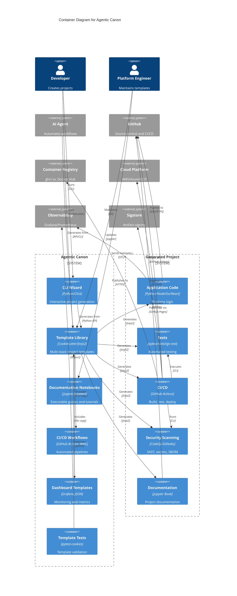

# C4 Container Diagram - Agentic Canon

## Overview

This Container diagram zooms into the Agentic Canon system, showing the high-level technology choices, how responsibilities are distributed across containers, and how containers communicate with each other.

## Diagram



## Plain Text Representation

```
┌──────────────────────────────────────────────────────────────────────┐
│                         AGENTIC CANON SYSTEM                         │
├──────────────────────────────────────────────────────────────────────┤
│                                                                      │
│  Template Generation Layer:                                          │
│  ├─ CLI Wizard (Python/Click) - Interactive generation              │
│  ├─ Template Library (Cookiecutter/Jinja2) - Core templates         │
│  ├─ Documentation Notebooks (Jupyter/Jupytext) - Guides             │
│  ├─ CI/CD Workflows (GitHub Actions YAML) - Pipeline templates      │
│  ├─ Dashboard Templates (Grafana JSON) - Monitoring configs         │
│  └─ Template Tests (pytest-cookies) - Validation                    │
│                                                                      │
└──────────────────────────────────────────────────────────────────────┘
                              ↓ generates
┌──────────────────────────────────────────────────────────────────────┐
│                         GENERATED PROJECT                            │
├──────────────────────────────────────────────────────────────────────┤
│                                                                      │
│  Application Layer:                                                  │
│  ├─ Application Code (Python/Node/Go/React) - Business logic        │
│  ├─ Tests (pytest/vitest/go test) - Validation                      │
│  ├─ CI/CD (GitHub Actions) - Automation                             │
│  ├─ Security Scanning (CodeQL/Gitleaks) - SAST, secrets, SBOM       │
│  └─ Documentation (Jupyter Book) - Project docs                     │
│                                                                      │
└──────────────────────────────────────────────────────────────────────┘
                              ↓ integrates with
┌──────────────────────────────────────────────────────────────────────┐
│                      EXTERNAL SERVICES                               │
├──────────────────────────────────────────────────────────────────────┤
│                                                                      │
│  ├─ GitHub (source control, CI/CD platform)                         │
│  ├─ Container Registry (ghcr.io, Docker Hub)                        │
│  ├─ Cloud Platform (AWS, Azure, GCP)                                │
│  ├─ Observability (Grafana, Prometheus, OpenTelemetry)              │
│  └─ Sigstore (keyless artifact signing)                             │
│                                                                      │
└──────────────────────────────────────────────────────────────────────┘
```

## Container Details

### Agentic Canon System Containers

#### 1. CLI Wizard

**Technology**: Python with Click/Typer framework  
**Purpose**: Interactive command-line interface for project generation  
**Key Features**:

- Step-by-step project configuration
- Template selection wizard
- Feature toggle interface
- Validation and preview
- Git repository initialization

**Interfaces**:

```python
# Command: agentic-canon init
# Inputs: User responses to prompts
# Outputs: Generated project directory
```

**Data Storage**: None (stateless)

#### 2. Template Library

**Technology**: Cookiecutter templates with Jinja2  
**Purpose**: Core repository of project templates  
**Structure**:

```
templates/
├── python-service/     # FastAPI/Flask services
├── node-service/       # Express/Fastify services
├── react-webapp/       # Vite + React + TypeScript
├── go-service/         # Go HTTP services
└── docs-only/          # Jupyter Book documentation
```

**Each template includes**:

- `cookiecutter.json` - Variables and defaults
- `hooks/` - Pre/post generation scripts
- `{{cookiecutter.project_slug}}/` - Template files

#### 3. Documentation Notebooks

**Technology**: Jupyter notebooks with Jupytext  
**Purpose**: Executable guides and tutorials  
**Contents**:

- `01_bootstrap.ipynb` - Repository scaffolding
- `02_security_supply_chain.ipynb` - Security practices
- `03_contracts_and_tests.ipynb` - Testing strategies
- `04_observability_slos.ipynb` - Monitoring setup
- `05_docs_to_book.ipynb` - Documentation workflow

**Format**: MyST Markdown (version controlled) + Jupyter Notebook (executable)

#### 4. CI/CD Workflows

**Technology**: GitHub Actions YAML  
**Purpose**: Reusable workflow templates  
**Categories**:

- Build and test pipelines
- Security scanning workflows
- Deployment workflows
- Notebook execution workflows
- Documentation publishing

**Integration**: Copied into generated projects during template generation

#### 5. Dashboard Templates

**Technology**: Grafana JSON  
**Purpose**: Pre-configured monitoring dashboards  
**Dashboard Types**:

- DORA metrics (deployment frequency, lead time, MTTR, change failure rate)
- SPACE metrics (satisfaction, performance, activity, communication, efficiency)
- Security metrics (vulnerabilities, scan results, SBOM status)
- Quality metrics (test coverage, mutation score, code duplication)

**Usage**: Imported into Grafana instances

#### 6. Template Tests

**Technology**: pytest with pytest-cookies plugin  
**Purpose**: Validate template rendering and correctness  
**Test Coverage**:

- Template renders successfully
- Required files generated
- Hooks execute correctly
- Variables substituted properly
- Optional features work correctly

**Execution**: CI runs on every template change

### Generated Project Containers

#### 1. Application Code

**Technology**: Language/framework specific  
**Supported Stacks**:

- **Python**: FastAPI, Flask, Django
- **Node.js**: Express, Fastify, Nest.js
- **Go**: Standard library, Gin, Echo
- **React**: Vite + TypeScript + SWC

**Structure**:

```
src/
├── main entry point
├── business logic
├── API routes/handlers
└── configuration
```

**Dependencies**: Managed via language package manager (pip, npm, go mod)

#### 2. Tests

**Technology**: Language-specific test frameworks  
**Test Types**:

- **Unit tests**: Individual function/component testing
- **Integration tests**: API endpoint testing
- **E2E tests**: Full user flow testing (for webapps)
- **Contract tests**: API contract validation

**Coverage Target**: ≥ 80%

**Frameworks**:

- Python: pytest + pytest-cov
- Node.js: Vitest or Jest
- Go: go test + testify
- React: Vitest + Testing Library + Playwright

#### 3. CI/CD

**Technology**: GitHub Actions  
**Pipeline Stages**:

1. **Build**: Compile/bundle application
2. **Test**: Run test suite with coverage
3. **Lint**: Code quality checks
4. **Security**: SAST, secret scanning, dependency audit
5. **SBOM**: Generate software bill of materials
6. **Sign**: Sign artifacts with Sigstore
7. **Deploy**: Deploy to target environment

**Triggers**: Push, pull request, schedule, manual

#### 4. Security Scanning

**Technology**: Multi-tool approach  
**Tools**:

- **CodeQL**: Static analysis (SAST)
- **Gitleaks/TruffleHog**: Secret detection
- **Trivy**: Container scanning
- **npm audit / pip-audit**: Dependency vulnerabilities
- **CycloneDX**: SBOM generation
- **Sigstore/Cosign**: Artifact signing

**Frequency**: On push, PR, and weekly schedule

#### 5. Documentation

**Technology**: Jupyter Book  
**Contents**:

- Getting started guide
- API documentation
- Architecture overview
- Development guide
- Deployment instructions

**Publishing**: GitHub Pages via GitHub Actions

## Data Flow

### Template Generation Flow

```
1. Developer runs CLI → 2. CLI reads template → 3. Jinja2 renders files
   ↓
4. Hooks validate → 5. Project created → 6. Git initialized
   ↓
7. Developer pushes to GitHub → 8. CI/CD activates
```

### CI/CD Execution Flow

```
1. Code push → 2. GitHub Actions triggered → 3. Tests run
   ↓
4. Security scans → 5. SBOM generated → 6. Artifacts signed
   ↓
7. Deploy to cloud → 8. Observability configured
```

### Observability Data Flow

```
1. App generates telemetry → 2. OpenTelemetry SDK collects
   ↓
3. Collector processes → 4. Exporters send to backends
   ↓
5. Prometheus stores metrics → 6. Grafana visualizes
```

## Technology Stack Summary

### Core Technologies

| Container        | Primary Tech   | Language | Purpose          |
| ---------------- | -------------- | -------- | ---------------- |
| CLI Wizard       | Click/Typer    | Python   | User interaction |
| Template Library | Cookiecutter   | Jinja2   | Code generation  |
| Notebooks        | Jupyter        | Python   | Documentation    |
| Workflows        | GitHub Actions | YAML     | CI/CD            |
| Tests            | pytest-cookies | Python   | Validation       |

### Generated Project Technologies

| Stack          | Language     | Framework | Testing           | Build       |
| -------------- | ------------ | --------- | ----------------- | ----------- |
| Python Service | Python 3.11+ | FastAPI   | pytest            | pip/build   |
| Node Service   | TypeScript   | Express   | Vitest            | npm/esbuild |
| React Webapp   | TypeScript   | React 18  | Vitest+Playwright | Vite        |
| Go Service     | Go 1.22+     | Standard  | go test           | go build    |

### Security Technologies

- CodeQL (SAST)
- Gitleaks/TruffleHog (secrets)
- Trivy/Grype (containers)
- Sigstore/Cosign (signing)
- CycloneDX (SBOM)

### Observability Technologies

- OpenTelemetry (instrumentation)
- Prometheus (metrics)
- Grafana (visualization)
- Jaeger/Tempo (tracing)
- Loki (logs)

## Communication Patterns

### Synchronous

- CLI → Template Library (Python API call)
- Tests → Template Library (pytest execution)
- CI/CD → Application Tests (process execution)

### Asynchronous

- Application → Observability (OTLP protocol)
- CI/CD → Security Scanning (workflow steps)
- Documentation → GitHub Pages (deployment)

### File-based

- Templates → Generated Files (Jinja2 rendering)
- Dashboards → Grafana (JSON import)
- Workflows → CI/CD (YAML configuration)

## Deployment Architecture

### Template System

- **Location**: GitHub repository
- **Execution**: Local machine or CI runner
- **Distribution**: Git clone or download

### Generated Projects

- **Development**: Local machine (Docker Compose optional)
- **Staging**: Cloud platform (auto-deployed via CI)
- **Production**: Cloud platform (approved deployments)

**Deployment Targets**:

- Containers (ECS, AKS, GKE, Cloud Run)
- Serverless (Lambda, Functions, Cloud Functions)
- PaaS (Heroku, Render, Railway)
- Static (GitHub Pages, Netlify, Vercel)

## Scaling Considerations

### Template System

- **Read-heavy**: Templates read frequently, written rarely
- **Stateless**: No database or persistent storage needed
- **Caching**: Git repository clones can be cached
- **Concurrency**: Multiple users can generate simultaneously

### Generated Projects

- **Application scaling**: Horizontal scaling via container orchestration
- **Database scaling**: Managed database services with read replicas
- **Cache scaling**: Redis/Memcached clusters
- **CDN**: Static assets served via CDN

## Security Boundaries

### Trust Boundaries

1. **Developer Machine ↔ GitHub**: Git authentication (SSH/HTTPS)
2. **GitHub Actions ↔ Cloud**: OIDC or secret-based auth
3. **Application ↔ Database**: Connection strings (secrets)
4. **Application ↔ External APIs**: API keys (secrets)

### Secret Management

- **Template System**: No secrets stored
- **Generated Projects**: Secrets in GitHub Secrets or cloud secret stores
- **CI/CD**: GITHUB_TOKEN for GitHub API, cloud credentials for deployment

## Related Diagrams

- **[C4 Context Diagram](c4-context-diagram.md)**: System-level view
- **[C4 Component Diagram](c4-component-diagram.md)**: Detailed component view

## References

- [C4 Model](https://c4model.com/)
- [Cookiecutter Documentation](https://cookiecutter.readthedocs.io/)
- [GitHub Actions Documentation](https://docs.github.com/en/actions)

---

_Last Updated: 2024-01-15_
_Version: 1.0_
