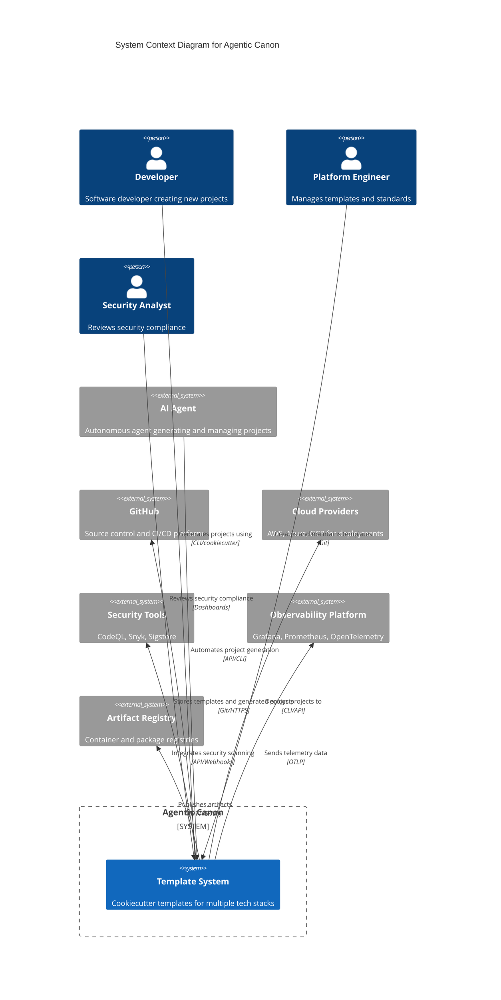

# C4 Context Diagram - Agentic Canon

## Overview

This Context diagram shows the Agentic Canon system at the highest level, depicting how it fits into the wider ecosystem and who its users are.

## Diagram



## Plain Text Representation

```
┌─────────────────────────────────────────────────────────────────────┐
│                          AGENTIC CANON                              │
│                                                                     │
│  Users:                                                             │
│  ├─ Developer (generates projects)                                 │
│  ├─ Platform Engineer (maintains templates)                        │
│  ├─ Security Analyst (reviews compliance)                          │
│  └─ AI Agent (automates workflows)                                 │
│                                                                     │
│  Core System:                                                       │
│  └─ Template System (Cookiecutter templates)                       │
│                                                                     │
│  External Systems:                                                  │
│  ├─ GitHub (source control, CI/CD)                                 │
│  ├─ Cloud Providers (AWS, Azure, GCP)                              │
│  ├─ Security Tools (CodeQL, Snyk, Sigstore)                        │
│  ├─ Observability (Grafana, Prometheus, OpenTelemetry)             │
│  └─ Artifact Registry (containers, packages)                       │
└─────────────────────────────────────────────────────────────────────┘
```

## Components

### People

| Actor                 | Role                                 | Interaction                                                               |
| --------------------- | ------------------------------------ | ------------------------------------------------------------------------- |
| **Developer**         | Creates new projects using templates | Uses CLI to generate projects, customizes based on needs                  |
| **Platform Engineer** | Maintains template library           | Creates new templates, updates existing ones, ensures best practices      |
| **Security Analyst**  | Ensures compliance                   | Reviews security policies, monitors dashboards, validates SLSA compliance |
| **AI Agent**          | Automates project management         | Generates projects, runs tests, deploys, monitors health                  |

### Core System

**Template System**: The heart of Agentic Canon

- Provides Cookiecutter templates for multiple technology stacks
- Python, Node.js, Go, React, documentation-only templates
- Includes CI/CD workflows, security scanning, observability setup
- Supports customization via template variables

### External Systems

| System                     | Purpose                          | Integration                                                                  |
| -------------------------- | -------------------------------- | ---------------------------------------------------------------------------- |
| **GitHub**                 | Source control and CI/CD         | Git repository hosting, GitHub Actions workflows, security features          |
| **Cloud Providers**        | Deployment targets               | AWS, Azure, GCP services for hosting applications                            |
| **Security Tools**         | Security scanning and compliance | CodeQL (SAST), Snyk (dependencies), Sigstore (signing), TruffleHog (secrets) |
| **Observability Platform** | Monitoring and alerting          | Grafana dashboards, Prometheus metrics, OpenTelemetry tracing                |
| **Artifact Registry**      | Package and container storage    | GitHub Container Registry, npm, PyPI, Docker Hub                             |

## Key Interactions

### 1. Project Generation Flow

```
Developer → Template System → GitHub
```

1. Developer runs `cookiecutter templates/python-service` or `agentic-canon init`
2. Template System generates project with all boilerplate
3. Developer pushes to GitHub
4. GitHub Actions run automatically

### 2. Template Maintenance Flow

```
Platform Engineer → Template System → GitHub → Security Tools
```

1. Platform Engineer updates template
2. Changes pushed to GitHub
3. Security tools validate changes
4. Template available for use

### 3. Deployment Flow

```
Template System → GitHub → Cloud Providers → Observability
```

1. Generated project includes deployment workflows
2. GitHub Actions build and deploy
3. Application runs on cloud provider
4. Telemetry flows to observability platform

### 4. AI Agent Automation Flow

```
AI Agent → Template System → GitHub → Security Tools → Observability
```

1. AI Agent generates project automatically
2. Runs tests and security scans
3. Deploys to cloud
4. Monitors health and performance
5. Auto-remediates issues

## Technology Choices

### Core Technologies

- **Cookiecutter**: Template engine (Python-based, language-agnostic)
- **Jinja2**: Template syntax
- **Jupytext**: Notebook version control
- **Jupyter Book**: Documentation publishing

### CI/CD

- **GitHub Actions**: Primary CI/CD platform
- **Azure Pipelines**: Secondary CI/CD option
- **pytest-cookies**: Template testing

### Security

- **CodeQL**: Static analysis
- **Gitleaks/TruffleHog**: Secret scanning
- **Sigstore/Cosign**: Artifact signing
- **CycloneDX**: SBOM generation
- **SLSA**: Supply chain security framework

### Observability

- **OpenTelemetry**: Telemetry collection
- **Prometheus**: Metrics storage and alerting
- **Grafana**: Visualization and dashboards
- **Jaeger/Tempo**: Distributed tracing

## Standards Compliance

The system is designed to comply with:

- **NIST SSDF v1.1**: Secure Software Development Framework
- **OWASP SAMM**: Software Assurance Maturity Model
- **SLSA Level 3**: Supply-chain Levels for Software Artifacts
- **OpenSSF Scorecard**: Open Source Security Foundation best practices
- **ISO/IEC 25010**: Software quality characteristics
- **ISO/IEC 5055**: Software structural quality
- **WCAG 2.2 AA**: Web accessibility (for web applications)

## Boundaries and Constraints

### In Scope

- ✅ Project template generation
- ✅ CI/CD workflow setup
- ✅ Security scanning integration
- ✅ Observability instrumentation
- ✅ Best practices enforcement
- ✅ Documentation generation

### Out of Scope

- ❌ Application business logic
- ❌ Cloud infrastructure provisioning (user responsibility)
- ❌ Database schema design
- ❌ Custom authentication systems
- ❌ Production data management

### Trust Boundaries

1. **Template System ↔ GitHub**: Authenticated via Git credentials
2. **Template System ↔ Cloud Providers**: Authenticated via cloud credentials
3. **GitHub Actions ↔ External Services**: Authenticated via secrets/OIDC
4. **Applications ↔ External Services**: API keys, OAuth, service accounts

## Deployment Context

### Generated Projects Run On

- **Containers**: Docker images on cloud platforms
- **Serverless**: AWS Lambda, Azure Functions, Google Cloud Functions
- **Kubernetes**: EKS, AKS, GKE
- **PaaS**: Heroku, Render, Railway
- **Static Hosting**: GitHub Pages, Netlify, Vercel (for docs)

### Template System Lives In

- **GitHub Repository**: Source of truth for templates
- **Local Machine**: Where developers run template generation
- **CI/CD Runners**: Where automated generation occurs

## Success Metrics

### Usage Metrics

- Number of projects generated
- Template adoption rate per stack
- Time to first deployment
- Template update frequency

### Quality Metrics

- Generated project test pass rate
- Security scan pass rate
- SLSA compliance level
- OpenSSF Scorecard score

### Developer Experience

- Setup time (target: < 5 minutes)
- Documentation clarity rating
- Issue resolution time
- Community contributions

## Related Diagrams

- **[C4 Container Diagram](c4-container-diagram.md)**: Detailed view of system components
- **[C4 Component Diagram](c4-component-diagram.md)**: Internal structure of template system

## References

- [C4 Model](https://c4model.com/)
- [Agentic Canon README](../../README.md)
- [TASKS.md](../../TASKS.md)
- [Architecture Decision Records](../adr/README.md)

---

_Last Updated: 2024-01-15_
_Version: 1.0_
