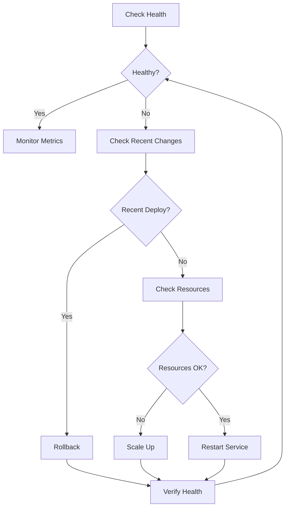

# Runbook: Agent-Oriented Automation

## Purpose

This runbook provides guidelines for AI agents and automation systems to interact with and operate projects generated from Agentic Canon templates. It includes machine-readable formats, decision trees, and automation patterns.

## Agent Capabilities Required

### Level 1: Basic Agent
- Execute commands via shell
- Read and parse files (JSON, YAML, Markdown)
- Make HTTP requests
- Interpret exit codes and output

### Level 2: Intermediate Agent  
- Interact with Git and GitHub
- Parse logs and metrics
- Make decisions based on conditions
- Handle errors and retries

### Level 3: Advanced Agent
- Multi-step reasoning and planning
- Context awareness across operations
- Learn from outcomes
- Optimize based on feedback

## Machine-Readable Project Metadata

### Project Discovery

All Agentic Canon projects include machine-readable metadata:

**File**: `project-metadata.json` (generated in project root)

```json
{
  "schema_version": "1.0",
  "project": {
    "name": "my-project",
    "slug": "my-project",
    "type": "service",
    "language": "python",
    "framework": "fastapi",
    "version": "0.1.0"
  },
  "capabilities": {
    "build": true,
    "test": true,
    "lint": true,
    "deploy": true,
    "security_scan": true,
    "sbom_generation": true
  },
  "commands": {
    "install": "pip install -e .[dev]",
    "build": "python -m build",
    "test": "pytest",
    "lint": "ruff check .",
    "format": "black .",
    "security": ".github/workflows/security.yml",
    "deploy": "See deployment-runbook.md"
  },
  "ci_cd": {
    "provider": "github",
    "workflows": [
      ".github/workflows/ci.yml",
      ".github/workflows/security.yml"
    ],
    "required_secrets": ["DEPLOY_TOKEN"],
    "optional_secrets": ["SLACK_WEBHOOK", "CODECOV_TOKEN"]
  },
  "observability": {
    "metrics": true,
    "tracing": true,
    "logging": true,
    "health_endpoint": "/health",
    "metrics_endpoint": "/metrics"
  },
  "security": {
    "sbom_format": "cyclonedx",
    "signing": "sigstore",
    "slsa_level": 2,
    "secret_scanning": true
  }
}
```

**Agent Action**: Read this file first to understand project structure

### Command Execution Map

**File**: `.agentic-canon/commands.json`

```json
{
  "install_dependencies": {
    "python": "pip install -e .[dev]",
    "node": "npm ci",
    "go": "go mod download",
    "react": "npm ci"
  },
  "run_tests": {
    "python": "pytest --cov",
    "node": "npm test",
    "go": "go test ./...",
    "react": "npm test -- --coverage"
  },
  "run_linter": {
    "python": "ruff check . && mypy .",
    "node": "npm run lint",
    "go": "golangci-lint run",
    "react": "npm run lint"
  },
  "build": {
    "python": "python -m build",
    "node": "npm run build",
    "go": "go build -o bin/app cmd/app/main.go",
    "react": "npm run build"
  },
  "start_dev": {
    "python": "uvicorn app.main:app --reload",
    "node": "npm run dev",
    "go": "go run cmd/app/main.go",
    "react": "npm run dev"
  }
}
```

## Automation Patterns

### Pattern 1: Health Check and Recovery

**Purpose**: Automatically detect and resolve common issues

**Decision Tree**:



**Agent Implementation**:

```python
def health_check_and_recover():
    """Automated health check and recovery."""
    max_retries = 3
    
    for attempt in range(max_retries):
        health = check_health()
        
        if health["status"] == "healthy":
            log("✓ System healthy")
            return True
        
        log(f"⚠ System unhealthy: {health['reason']}")
        
        # Decision tree
        if was_recent_deployment():
            log("→ Recent deployment detected, rolling back")
            rollback_deployment()
        elif are_resources_exhausted():
            log("→ Resources exhausted, scaling up")
            scale_resources(replicas=current_replicas() * 2)
        else:
            log("→ Restarting service")
            restart_service()
        
        wait(30)  # Wait for recovery
    
    log("✗ Recovery failed, escalating to human")
    create_incident(severity="SEV2", description="Automated recovery failed")
    return False


def check_health():
    """Check service health."""
    try:
        response = requests.get("https://api.example.com/health", timeout=5)
        if response.status_code == 200:
            return {"status": "healthy"}
        else:
            return {"status": "unhealthy", "reason": f"HTTP {response.status_code}"}
    except Exception as e:
        return {"status": "unhealthy", "reason": str(e)}
```

### Pattern 2: Automated Testing Pipeline

**Purpose**: Run comprehensive tests before deployment

**Workflow**:

```yaml
# Agent executes this workflow
name: Automated Testing
steps:
  - name: Setup
    run: |
      # Install dependencies based on project type
      ./scripts/install-dependencies.sh
  
  - name: Lint
    run: |
      ./scripts/lint.sh
    continue_on_error: true
    
  - name: Unit Tests
    run: |
      ./scripts/test-unit.sh
    
  - name: Integration Tests
    run: |
      ./scripts/test-integration.sh
    
  - name: Security Scan
    run: |
      ./scripts/security-scan.sh
    
  - name: Generate Report
    run: |
      ./scripts/generate-test-report.sh
    
  - name: Decide
    run: |
      if all_tests_passed; then
        approve_deployment
      else
        block_deployment
        notify_team
      fi
```

**Agent Implementation**:

```python
def run_automated_tests(project_path: str) -> dict:
    """Run automated test pipeline."""
    results = {
        "passed": [],
        "failed": [],
        "warnings": []
    }
    
    steps = [
        ("install", "Install dependencies"),
        ("lint", "Linting"),
        ("unit_test", "Unit tests"),
        ("integration_test", "Integration tests"),
        ("security_scan", "Security scan")
    ]
    
    for step_id, step_name in steps:
        log(f"→ Running {step_name}...")
        
        result = execute_step(project_path, step_id)
        
        if result["exit_code"] == 0:
            results["passed"].append(step_name)
            log(f"  ✓ {step_name} passed")
        else:
            results["failed"].append({
                "step": step_name,
                "error": result["output"]
            })
            log(f"  ✗ {step_name} failed: {result['output']}")
            
            if step_id in ["unit_test", "security_scan"]:
                # Critical failures - stop
                break
    
    # Generate report
    generate_test_report(results)
    
    # Decision
    if len(results["failed"]) == 0:
        approve_deployment()
        return {"status": "approved", "results": results}
    else:
        block_deployment()
        notify_team(results)
        return {"status": "blocked", "results": results}
```

### Pattern 3: Dependency Update Automation

**Purpose**: Automatically update dependencies with safety checks

**Algorithm**:

```
1. Check for available updates
2. For each update:
   a. Create branch
   b. Update dependency
   c. Run tests
   d. If tests pass:
      - Create PR with changelog
      - Request review
   e. If tests fail:
      - Document failure
      - Skip this update
3. Report summary
```

**Agent Implementation**:

```python
def automated_dependency_updates():
    """Automate dependency updates with testing."""
    updates = check_for_updates()
    
    results = {
        "successful": [],
        "failed": [],
        "skipped": []
    }
    
    for update in updates:
        log(f"→ Processing {update['package']} {update['current']} → {update['latest']}")
        
        # Safety checks
        if update["is_major_version"]:
            log(f"  ⚠ Major version update, requires manual review")
            results["skipped"].append(update)
            continue
        
        if update["has_breaking_changes"]:
            log(f"  ⚠ Breaking changes detected, requires manual review")
            results["skipped"].append(update)
            continue
        
        # Create branch
        branch_name = f"deps/update-{update['package']}-{update['latest']}"
        create_branch(branch_name)
        
        # Update dependency
        update_dependency_file(update)
        
        # Run tests
        test_result = run_tests()
        
        if test_result["passed"]:
            # Create PR
            pr = create_pr(
                branch=branch_name,
                title=f"chore: update {update['package']} to {update['latest']}",
                body=generate_pr_body(update, test_result)
            )
            results["successful"].append({
                "update": update,
                "pr": pr
            })
            log(f"  ✓ PR created: {pr['url']}")
        else:
            # Document failure
            results["failed"].append({
                "update": update,
                "reason": test_result["failures"]
            })
            log(f"  ✗ Tests failed, skipping update")
            
            # Cleanup
            delete_branch(branch_name)
    
    # Report
    generate_update_report(results)
    notify_team(results)
    
    return results
```

### Pattern 4: Continuous Security Monitoring

**Purpose**: Continuously scan for security issues and auto-remediate

**Monitoring Loop**:

```python
def continuous_security_monitoring():
    """Continuous security monitoring and auto-remediation."""
    while True:
        log("→ Running security scans...")
        
        # 1. Secret scanning
        secrets = scan_for_secrets()
        if secrets:
            for secret in secrets:
                alert_security_team(secret)
                if secret["is_revokable"]:
                    revoke_secret(secret)
        
        # 2. Dependency vulnerabilities
        vulns = scan_dependencies()
        for vuln in vulns:
            if vuln["severity"] in ["CRITICAL", "HIGH"]:
                # Try auto-patch
                if vuln["has_patch"]:
                    log(f"  → Auto-patching {vuln['package']}")
                    apply_security_patch(vuln)
                else:
                    create_security_issue(vuln)
        
        # 3. Container scanning
        if has_containers():
            container_vulns = scan_containers()
            if container_vulns:
                rebuild_containers()
        
        # 4. IaC security
        if has_infrastructure_code():
            iac_issues = scan_iac()
            if iac_issues:
                create_iac_remediation_pr(iac_issues)
        
        # 5. SBOM validation
        sbom = generate_sbom()
        validate_sbom_compliance(sbom)
        
        log("✓ Security scan complete")
        
        # Wait before next scan (e.g., hourly)
        sleep(3600)
```

### Pattern 5: Performance Optimization

**Purpose**: Automatically identify and optimize performance issues

**Agent Implementation**:

```python
def automated_performance_optimization():
    """Identify and optimize performance issues."""
    
    # 1. Collect metrics
    metrics = collect_performance_metrics(duration="24h")
    
    # 2. Analyze patterns
    issues = analyze_metrics(metrics)
    
    optimizations = []
    
    for issue in issues:
        log(f"→ Detected issue: {issue['description']}")
        
        if issue["type"] == "slow_query":
            # Suggest index
            optimization = suggest_database_index(issue)
            optimizations.append(optimization)
            
        elif issue["type"] == "high_memory":
            # Suggest caching
            optimization = suggest_caching_strategy(issue)
            optimizations.append(optimization)
            
        elif issue["type"] == "high_latency":
            # Suggest async processing
            optimization = suggest_async_processing(issue)
            optimizations.append(optimization)
    
    # 3. Create optimization PR
    if optimizations:
        create_optimization_pr(optimizations)
    
    return optimizations
```

## Agent Decision Framework

### Decision Predicates

**Conditions for automated actions**:

```python
def can_auto_deploy(context: dict) -> bool:
    """Determine if automatic deployment is safe."""
    return (
        context["all_tests_passed"] and
        context["security_scan_clean"] and
        context["code_review_approved"] and
        context["deployment_window_open"] and
        not context["recent_incidents"] and
        context["error_budget_available"]
    )


def should_rollback(context: dict) -> bool:
    """Determine if automatic rollback is needed."""
    return (
        context["error_rate"] > context["error_threshold"] or
        context["latency_p95"] > context["latency_slo"] * 1.5 or
        context["health_check_failing"] or
        context["crash_loop_detected"]
    )


def needs_human_intervention(context: dict) -> bool:
    """Determine if human intervention is required."""
    return (
        context["severity"] == "SEV1" or
        context["data_loss_risk"] or
        context["security_breach_suspected"] or
        context["auto_recovery_failed"] >= 3 or
        context["business_logic_affected"]
    )
```

### Escalation Criteria

```python
class EscalationLevel:
    AUTO_HANDLE = "auto"  # Agent handles automatically
    AUTO_WITH_NOTIFY = "auto_notify"  # Auto-handle but notify team
    HUMAN_REVIEW = "human_review"  # Human review before action
    IMMEDIATE_ESCALATION = "escalate"  # Immediate human intervention


def determine_escalation_level(issue: dict) -> EscalationLevel:
    """Determine appropriate escalation level."""
    
    # Immediate escalation
    if issue["severity"] == "CRITICAL":
        return EscalationLevel.IMMEDIATE_ESCALATION
    
    if issue["affects_production"]:
        return EscalationLevel.IMMEDIATE_ESCALATION
    
    # Human review required
    if issue["is_security_related"]:
        return EscalationLevel.HUMAN_REVIEW
    
    if issue["requires_breaking_change"]:
        return EscalationLevel.HUMAN_REVIEW
    
    # Auto with notification
    if issue["severity"] == "HIGH":
        return EscalationLevel.AUTO_WITH_NOTIFY
    
    # Fully automated
    return EscalationLevel.AUTO_HANDLE
```

## Agent Communication Protocols

### Status Reporting

**Format**: JSON status reports

```json
{
  "timestamp": "2024-01-15T14:30:00Z",
  "agent_id": "auto-deploy-bot",
  "operation": "deployment",
  "status": "in_progress",
  "progress": {
    "current_step": 3,
    "total_steps": 5,
    "step_name": "Running integration tests"
  },
  "metrics": {
    "duration_seconds": 120,
    "tests_passed": 145,
    "tests_failed": 0
  },
  "next_action": "Deploy to staging",
  "estimated_completion": "2024-01-15T14:35:00Z"
}
```

### Incident Reporting

```json
{
  "timestamp": "2024-01-15T14:30:00Z",
  "agent_id": "health-monitor-bot",
  "incident_type": "service_degradation",
  "severity": "SEV2",
  "description": "API response time exceeded SLO threshold",
  "affected_components": ["api-service", "database"],
  "metrics": {
    "error_rate": 0.05,
    "latency_p95": 2500,
    "requests_affected": 1500
  },
  "automated_actions_taken": [
    "Scaled replicas from 3 to 6",
    "Cleared cache",
    "Restarted unhealthy pods"
  ],
  "current_status": "monitoring",
  "requires_human": false
}
```

## Safety Mechanisms

### Rate Limiting

```python
class AgentRateLimiter:
    """Prevent runaway automation."""
    
    def __init__(self):
        self.action_counts = {}
        self.limits = {
            "deployment": {"max": 5, "window": 3600},  # 5 per hour
            "rollback": {"max": 3, "window": 3600},    # 3 per hour
            "scale": {"max": 10, "window": 3600},      # 10 per hour
        }
    
    def can_perform_action(self, action: str) -> bool:
        """Check if action is within rate limits."""
        now = time.time()
        
        if action not in self.action_counts:
            self.action_counts[action] = []
        
        # Remove old actions outside window
        limit = self.limits[action]
        self.action_counts[action] = [
            t for t in self.action_counts[action]
            if now - t < limit["window"]
        ]
        
        # Check if under limit
        if len(self.action_counts[action]) < limit["max"]:
            self.action_counts[action].append(now)
            return True
        
        return False
```

### Dry Run Mode

```python
def execute_with_safety(action: callable, dry_run: bool = True):
    """Execute action with safety checks."""
    
    # Always log what would happen
    log(f"[{'DRY RUN' if dry_run else 'EXECUTE'}] {action.__name__}")
    
    if dry_run:
        # Simulate action
        log(f"  → Would execute: {action}")
        return {"status": "simulated", "would_succeed": True}
    else:
        # Execute with rollback capability
        try:
            result = action()
            log(f"  ✓ Action succeeded")
            return {"status": "success", "result": result}
        except Exception as e:
            log(f"  ✗ Action failed: {e}")
            # Attempt rollback
            rollback_action()
            return {"status": "failed", "error": str(e)}
```

## Monitoring and Observability for Agents

### Agent Metrics

Track agent performance:

```python
# Prometheus metrics for agents
agent_operations_total = Counter(
    'agent_operations_total',
    'Total operations performed by agent',
    ['agent_id', 'operation', 'status']
)

agent_operation_duration = Histogram(
    'agent_operation_duration_seconds',
    'Duration of agent operations',
    ['agent_id', 'operation']
)

agent_errors_total = Counter(
    'agent_errors_total',
    'Total errors encountered by agent',
    ['agent_id', 'operation', 'error_type']
)
```

### Agent Logs

Structured logging format:

```json
{
  "timestamp": "2024-01-15T14:30:00Z",
  "level": "INFO",
  "agent_id": "deploy-bot",
  "operation": "deploy",
  "message": "Deploying version 1.2.3 to production",
  "context": {
    "version": "1.2.3",
    "environment": "production",
    "triggered_by": "merge_to_main"
  },
  "trace_id": "abc123"
}
```

## Best Practices for Agent Development

1. **Idempotency**: Operations should be safe to retry
2. **Observability**: Log all decisions and actions
3. **Safety First**: Default to conservative actions
4. **Human in Loop**: Escalate ambiguous situations
5. **Graceful Degradation**: Fall back to safe mode on errors
6. **Test Thoroughly**: Test agent logic extensively
7. **Version Control**: Track agent code changes
8. **Monitor Performance**: Track agent metrics
9. **Document Decisions**: Explain reasoning in logs
10. **Iterate**: Continuously improve based on outcomes

## References

- [Agent Runbook JSON](agent-runbook.json)
- [Template Creation Runbook](template-creation-runbook.md)
- [Deployment Runbook](deployment-runbook.md)
- [Incident Response Runbook](incident-response-runbook.md)
- [OpenAI Function Calling](https://platform.openai.com/docs/guides/function-calling)
- [LangChain Agents](https://python.langchain.com/docs/modules/agents/)

---

*For agent development support, see CONTRIBUTING.md or open a GitHub discussion.*
